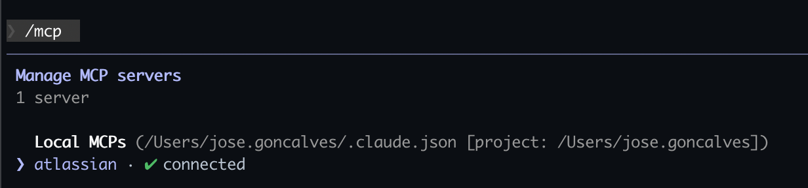

# Uphold Agentic AI

A repository containing reusable AI agent configurations, skills, and commands for Claude Code. This setup enables a structured, productive workflow when working with AI assistants across Uphold's repositories.

---

## Table of Contents

- [Overview](#overview)
- [What are MCP Servers?](#what-are-mcp-servers)
- [Key Concepts](#key-concepts)
  - [Agents](#agents)
  - [Commands](#commands)
  - [Skills](#skills)
  - [How They Interoperate](#how-they-interoperate)
- [Repository Structure](#repository-structure)
- [Getting Started](#getting-started)
- [References](#references)

---

## Overview

This repository provides a standardized configuration for Claude Code, enabling AI-assisted development with:

- **MCP server integrations** (e.g., Jira/Confluence)
- **Reusable agents** for specialized tasks
- **Slash commands** for quick actions
- **Skills** for complex multi-step workflows

---

## What are MCP Servers?

**Model Context Protocol (MCP)** is an open standard that allows AI assistants to connect with external tools and data sources. MCP servers act as bridges between Claude and third-party services.

### Why Do We Need MCP?

Without MCP, AI assistants are limited to what's in the conversation context. MCP enables:

1. **Live data access** — Query real-time information from external systems
2. **Action execution** — Perform operations in external tools (create tickets, update records)
3. **Context enrichment** — Pull relevant information automatically without copy-pasting

### Why is MCP Useful?

**Example: Jira/Atlassian Integration**

With the Atlassian MCP server configured, Claude can:

| Capability | What It Enables |
|------------|-----------------|
| `getJiraIssue` | Fetch ticket details, status, and description |
| `searchJiraIssuesUsingJql` | Query issues using JQL (e.g., find all bugs assigned to you) |
| `transitionJiraIssue` | Move tickets through workflow states |
| `getTransitionsForJiraIssue` | Check available status transitions |

**Real-world workflow:**
```
You: "What's the status of PROJ-123?"
Claude: [Uses MCP to fetch Jira ticket] "PROJ-123 is 'In Review' - assigned to you with 2 comments"

You: "Move it to Done"
Claude: [Uses MCP to transition ticket] "Done! PROJ-123 is now marked as 'Done'"
```

This eliminates context-switching between tools and keeps you in your development flow.



---

## Key Concepts

### Agents

**Agents** are specialized AI personas with defined expertise and toolsets. They focus on specific domains and can be invoked for targeted tasks.

| Agent | Purpose |
|-------|---------|
| `code-reviewer` | Performs thorough code reviews focusing on best practices, security, and project standards |

**Location:** `.claude/agents/`

Agents define:
- **Tools** they can access (e.g., `Read`, `Grep`, `Bash`)
- **Expertise area** (e.g., code review, architecture)
- **Specific checklists** to follow

---

### Commands

**Commands** are slash-invokable actions (`/command-name`) that execute predefined workflows. They're shortcuts for common operations.

| Command | Description |
|---------|-------------|
| `/amend-commit-message` | Amend the last commit message and force push |
| `/brainstorm` | Explore requirements and design before implementation |
| `/commit-push-pr` | Stage, commit, push, and open a PR in one action |
| `/create-commit` | Stage, commit, and push changes to origin |
| `/create-mermaid-diagram` | Generate Mermaid diagrams for code flows |
| `/create-pr` | Create a pull request for current branch |
| `/execute-plan` | Execute implementation plans with review checkpoints |
| `/export-mermaid-to-png` | Convert Mermaid diagrams to PNG images |
| `/fix-pr-comments` | Get PR review comments and fix them |
| `/review-pr` | Review a pull request and post feedback |
| `/squash-commits` | Squash all commits in current branch into the first one |
| `/write-plan` | Create detailed implementation plans |

**Location:** `.claude/commands/`

Commands define:
- **Allowed tools** for the operation
- **Workflow steps** to execute
- **Arguments** accepted (if any)

---

### Skills

**Skills** are comprehensive knowledge modules that guide Claude through complex, multi-step workflows. They contain detailed instructions, principles, and processes.

| Skill | When to Use |
|-------|-------------|
| `brainstorming` | Before any creative work — turns ideas into fully-formed designs |
| `doc-coauthoring` | Writing documentation, proposals, technical specs |
| `executing-plans` | Implementing a written plan with batch execution and review checkpoints |
| `writing-plans` | Creating detailed implementation plans before touching code |

**Location:** `.claude/skills/`

Skills provide:
- **Step-by-step processes** for complex tasks
- **Best practices** and principles to follow
- **Output artifacts** (e.g., plan documents, design docs)

---

### How They Interoperate

```
┌─────────────────────────────────────────────────────────────┐
│                     User Request                            │
└─────────────────────────────────────────────────────────────┘
                              │
                              ▼
┌─────────────────────────────────────────────────────────────┐
│                    COMMANDS (Entry Point)                   │
│         Quick actions invoked via /command-name             │
│                                                             │
│   /brainstorm → /write-plan → /execute-plan → /review-pr   │
└─────────────────────────────────────────────────────────────┘
                              │
                              ▼
┌─────────────────────────────────────────────────────────────┐
│                    SKILLS (Knowledge Base)                  │
│          Detailed workflows that commands invoke            │
│                                                             │
│   brainstorming → writing-plans → executing-plans           │
└─────────────────────────────────────────────────────────────┘
                              │
                              ▼
┌─────────────────────────────────────────────────────────────┐
│                    AGENTS (Specialists)                     │
│        Specialized personas for specific domains            │
│                                                             │
│   code-reviewer (invoked during /review-pr)                 │
└─────────────────────────────────────────────────────────────┘
                              │
                              ▼
┌─────────────────────────────────────────────────────────────┐
│                    MCP SERVERS (Integrations)               │
│          External tool connections (Jira, etc.)             │
│                                                             │
│   Fetch issues, transition tickets, search JQL              │
└─────────────────────────────────────────────────────────────┘
```

**Typical workflow:**
1. User runs `/brainstorm` to explore an idea
2. Command invokes the `brainstorming` skill for structured exploration
3. Once design is ready, `/write-plan` creates implementation tasks
4. `/execute-plan` implements changes with checkpoints
5. `/review-pr` uses the `code-reviewer` agent for quality checks
6. MCP servers enable Jira ticket updates throughout

---

## Repository Structure

```
uphold-agentic-ai/
├── .mcp.json              # MCP server configuration (Atlassian)
├── AGENTS.md              # Global instructions for AI behavior
├── CLAUDE.md              # Claude Code configuration pointer
├── README.md              # This file
├── resources/
│   └── atlassian-mcp-server.png
└── .claude/
    ├── settings.json      # Permissions and allowed tools
    ├── agents/
    │   └── code-reviewer.md
    ├── commands/
    │   ├── amend-commit-message.md
    │   ├── brainstorm.md
    │   ├── commit-push-pr.md
    │   ├── create-commit.md
    │   ├── create-mermaid-diagram.md
    │   ├── create-pr.md
    │   ├── execute-plan.md
    │   ├── export-mermaid-to-png.md
    │   ├── fix-pr-comments.md
    │   ├── review-pr.md
    │   ├── squash-commits.md
    │   └── write-plan.md
    └── skills/
        ├── brainstorming/SKILL.md
        ├── doc-coauthoring/SKILL.md
        ├── executing-plans/SKILL.md
        └── writing-plans/SKILL.md
```

### File Descriptions

| File | Purpose |
|------|---------|
| `.mcp.json` | Configures MCP servers (Atlassian integration via SSE) |
| `AGENTS.md` | Global instructions for plan mode and PR creation |
| `CLAUDE.md` | Entry point pointing Claude to `.claude/` configuration |
| `.claude/settings.json` | Defines allowed tools and permissions (git, npm, MCP tools) |

---

## Getting Started

1. **Clone this repository** and copy everything to your project's root directory
2. **Configure MCP servers** (see References for Atlassian setup)
3. **Use commands** with `/command-name` in Claude Code
4. **Customize** agents, commands, and skills for your team's needs

---

## References

- [Model Context Protocol Documentation](https://modelcontextprotocol.io/docs/getting-started/intro)
- [How to Connect Atlassian MCP Server to Claude Code](https://medium.com/@milad.jafary/how-to-connect-atlassian-mcp-server-to-claude-code-5c22d47d5cd5)
